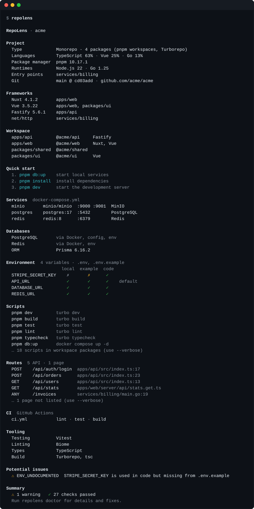
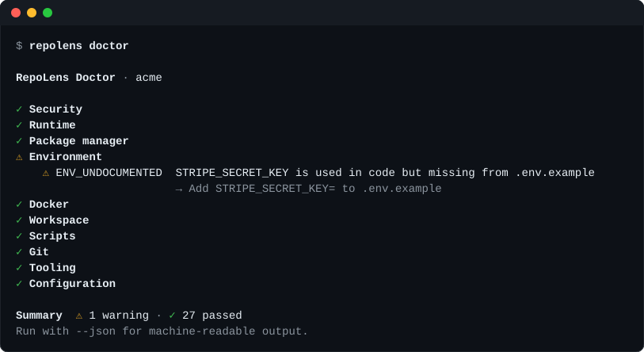

<p align="center">
  <picture>
    <source media="(prefers-color-scheme: dark)" srcset="assets/logo-dark.svg">
    
  </picture>
</p>

<h3 align="center">Entenda qualquer repositório em segundos.</h3>

<p align="center">
  <a href="https://www.npmjs.com/package/repolens-cli"></a>
  <a href="https://github.com/Douglas-Strey/repolens-cli/actions/workflows/ci.yml"></a>
  
  <a href="LICENSE"></a>
  
</p>

<p align="center"><a href="README.md">English</a> · <b>Português (Brasil)</b></p>

O RepoLens lê uma base de código e mostra como as peças se encaixam: a stack, o que precisa
estar rodando, quais variáveis de ambiente você precisa, como iniciar o projeto e o que está
mal configurado.

**Não precisa configurar nada. Sem upload para a nuvem. Sem API de IA. Ele nunca executa o
seu código.**

```sh
npx repolens-cli
```

<p align="center">
  
</p>

## Por quê

Entrar em um projeto costuma começar com 20 minutos de arqueologia. Qual gerenciador de
pacotes? Qual versão do Node, e por que o Dockerfile discorda do `.nvmrc`? O que precisa
estar rodando localmente? Quais variáveis de ambiente o código realmente lê, e por que aquela
ali não está no `.env.example`?

O RepoLens faz esse levantamento por você, lendo apenas os arquivos do repositório.

## Início rápido

```sh
npx repolens-cli              # visão geral do diretório atual
npx repolens-cli doctor       # problemas de setup, com correções sugeridas
npx repolens-cli ../other-repo --json
```

Ou instale para usar o comando mais curto, `repolens`:

```sh
brew install douglas-strey/tap/repolens   # macOS e Linux (Homebrew)
npm install -g repolens-cli                # qualquer sistema com Node.js 22+
```

Funciona em macOS, Linux e Windows. O pacote npm precisa do Node.js 22 ou mais recente; o
Homebrew instala o Node para você.

> **Vai analisar um repositório em que você não confia?** Rode o RepoLens *fora* dele, por
> exemplo `cd ~ && npx repolens-cli ~/path/to/repo`, ou use uma instalação global. Quando o
> `npx` roda dentro de um repositório, o próprio npm respeita o `.npmrc` e o `node_modules`
> desse repositório, que podem trocar o pacote por outro antes mesmo de o RepoLens iniciar.

## O que ele mostra

| | |
| --- | --- |
| **Projeto** | Tipo (monorepo, app, biblioteca, CLI), linguagens, gerenciador de pacotes, versões de runtime, pacotes `main` do Go e comandos `bin`, branch e remote do Git |
| **Frameworks** | Por pacote do workspace, com a versão e a evidência por trás de cada detecção |
| **Workspace** | Workspaces do pnpm / npm / Yarn / Bun, Turborepo, Nx, Lerna, `go.work`, com o framework de cada pacote |
| **Início rápido** | Primeiros comandos sugeridos: copiar o arquivo env, subir os serviços do Compose, instalar, rodar |
| **Serviços** | Serviços do Docker Compose com imagens, portas publicadas e perfis, além de Dockerfiles (imagens base, estágios, portas expostas) |
| **Bancos de dados** | PostgreSQL, MySQL, MongoDB, Redis, SQLite e outros, a partir de drivers, imagens do Compose, URLs em variáveis de ambiente e configuração do Prisma / Drizzle / TypeORM, além do ORM em uso |
| **Ambiente** | Todas as variáveis: está definida no `.env`, documentada no `.env.example`, usada no código? **Só os nomes**; os valores nunca são exibidos |
| **Scripts** | Scripts do package.json com o comando exato para rodá-los, além de Makefile, justfile, Taskfile e tasks do Deno |
| **Rotas** | Rotas de API e páginas de Nuxt, Next.js, Express, Fastify, NestJS, Hono, Gin, Echo, chi, Fiber, Gorilla mux e `net/http` |
| **CI** | Workflows e o que cada job faz (lint, test, build, deploy, …) |
| **Ferramentas** | Frameworks de teste, linters, formatadores, type checkers, hooks do Git e ferramentas de build |

Use `--verbose` para ver achados de baixa confiança, a evidência por trás de cada detecção e
todas as variáveis, rotas e scripts.

## `repolens doctor`

O `doctor` roda 34 verificações de problemas que fazem equipes perderem tempo. Cada achado
tem um código estável, uma explicação de uma linha e uma correção sugerida:

<p align="center">
  
</p>

Algumas das coisas que ele detecta:

- variáveis de ambiente **usadas no código mas ausentes do `.env.example`**, e variáveis documentadas que nada lê
- **arquivos `.env` rastreados pelo Git**, ou não cobertos pelo `.gitignore`
- uma **credencial real commitada no `.env.example`** (chaves da AWS, tokens do GitHub, chaves live do Stripe, …), reportada só pelo nome da variável
- segredos expostos ao navegador (`NEXT_PUBLIC_…SECRET`, `VITE_…PASSWORD`)
- **`package-lock.json` ao lado de `pnpm-lock.yaml`**, ou um lockfile que contradiz o `packageManager`
- **versões do Node que não batem** entre `.nvmrc`, `.node-version`, `engines`, Dockerfiles e CI, e versões em fim de vida
- um `go.mod` que pede um Go mais novo do que a imagem Docker ou o CI fornecem
- **dois serviços do Compose publicando a mesma porta**, e `DATABASE_URL` apontando para 5433 enquanto o Postgres está publicado na 5432
- entradas `env_file` que não existem, chaves `version:` obsoletas no Compose
- `turbo.json` ainda usando `pipeline` no Turborepo 2, `.eslintrc` legado com ESLint 9+, configuração de workspace duplicada
- arquivos de configuração com erro de parse

Veja todas as verificações em [docs/pt-BR/diagnostics.md](docs/pt-BR/diagnostics.md).

```sh
repolens doctor              # código de saída 1 se houver erros
repolens doctor --strict     # também falha com avisos
repolens doctor --json       # para scripts e CI
```

Uma análise simples com `repolens` sempre termina com código de saída 0 quando é concluída,
então colocá-la no log do CI nunca quebra um build. Para barrar o build, use o `doctor`:

```yaml
- run: npx --yes repolens-cli doctor --fail-on error
```

## Configuração

O RepoLens não precisa de configuração. Para ajustá-lo, adicione um `repolens.config.json` ao
projeto (compartilhado com todo mundo que analisa o projeto, inclusive o CI) ou uma
configuração do usuário em `~/.config/repolens/config.json` (seus padrões em qualquer lugar):

```jsonc
{
  "$schema": "https://unpkg.com/repolens-cli/schema/config.schema.json",
  "ignore": ["legacy/", "src/generated/"],        // sintaxe do .gitignore
  "doctor": {
    "failOn": "warning",                            // padrão para --fail-on
    "rules": { "ENV_UNUSED": "off", "LOCKFILE_MISSING": "error" }
  },
  "environment": { "provided": ["FLY_*"] }          // definidas pela plataforma, nunca "ausentes"
}
```

`repolens config` mostra quais arquivos se aplicam e as configurações em vigor, e
`--no-config` ignora todos eles. A configuração é JSON puro, que o RepoLens nunca executa, e
a configuração de um repositório não consegue desligar as verificações de segurança dele.
Veja [docs/pt-BR/configuration.md](docs/pt-BR/configuration.md).

## Saída JSON

```sh
repolens --json | jq '.environment.variables[] | select(.used and (.documented | not)) | .name'
repolens --json | jq '.routes.routes[] | "\(.method) \(.path)"'
```

A saída JSON é versionada (`"schemaVersion": 1`), determinística (sem timestamps, arrays
ordenados, só caminhos relativos) e documentada em
[docs/pt-BR/json-schema.md](docs/pt-BR/json-schema.md). Os tipos TypeScript são exportados
pelo pacote:

```ts
import { scan } from 'repolens-cli'

const result = await scan({ cwd: '/path/to/repo' })
console.log(result.frameworks.map((f) => f.name))
```

## Relatórios e contexto para agentes

`repolens report` gera o panorama completo em Markdown, útil para docs de onboarding,
auditorias técnicas ou para colar em um chat de IA:

```sh
repolens report --output REPOLENS.md
```

`repolens agent init` *(experimental)* gera um contexto curto e estruturado para agentes de
código como Claude Code, Codex, Cursor ou Copilot. Ele cobre os comandos a rodar, as
convenções que o RepoLens consegue sustentar com evidências ("use pnpm, não npm", "Node 22",
"o CI roda lint, test e build"), a estrutura, os serviços, os nomes das variáveis de ambiente
e os problemas conhecidos:

```sh
repolens agent init        # gera .repolens/*.md
repolens agent             # imprime agent-context.md no stdout
```

Aponte seu agente para ele no `AGENTS.md` ou no `CLAUDE.md`. Revise os arquivos antes de
commitá-los; eles nunca contêm valores de segredos.

## Tecnologias suportadas

| Área | Suporte |
| --- | --- |
| Linguagens | JavaScript, TypeScript e Go em profundidade. Contagem de arquivos para Python, Rust, Ruby, PHP, Java, Kotlin, Swift, C/C++, C#, Shell e outras |
| Gerenciadores de pacotes | npm, pnpm (incluindo catalogs), Yarn Classic e Berry, Bun, Go modules; `packageManager` e `devEngines` |
| Runtimes | Node.js (`.nvmrc`, `.node-version`, `.tool-versions`, mise, `engines`, Volta, `devEngines`, Dockerfiles, CI), Go, Bun, Deno |
| Monorepos | Workspaces do pnpm, npm, Yarn e Bun, Turborepo, Nx, Lerna, `go.work` |
| Frameworks | Nuxt, Next.js, Remix, React Router, SvelteKit, Astro, Angular, React, Vue, Svelte, Solid, Preact, Qwik, Express, Fastify, NestJS, Koa, Hono, hapi, Elysia, AdonisJS, tRPC, Electron, React Native, Expo, Gatsby, Docusaurus, VitePress; Go: Gin, Echo, chi, Fiber, Gorilla mux, gRPC, `net/http` |
| Rotas | Nuxt (rotas de servidor e páginas, `srcDir`), Next.js (App Router e Pages Router, `basePath`, `pageExtensions`), Express, Fastify, NestJS, Hono, Gin, Echo, chi, Fiber, Gorilla mux, `net/http`; prefixos de router são resolvidos entre arquivos, inclusive routers Go passados para funções |
| Bancos de dados e ORMs | PostgreSQL, MySQL, MariaDB, SQLite/libSQL, MongoDB, Redis/Valkey, CockroachDB, SQL Server, ClickHouse e outros; Prisma, Drizzle, TypeORM, Sequelize, MikroORM, Kysely, Knex, Mongoose, GORM, Ent, sqlx, sqlc |
| Containers | Docker Compose (todos os nomes de arquivo, overrides e variantes, sintaxe longa e curta), Dockerfiles (multi-stage, substituição de `ARG`) |
| CI | GitHub Actions, GitLab CI, CircleCI, Forgejo/Gitea Actions; Azure Pipelines, Jenkins, Travis, Bitbucket, Buildkite, Drone e Woodpecker são listados |
| Ferramentas | Vitest, Jest, Mocha, AVA, `node:test`, Bun test, Playwright, Cypress, go test, pytest; ESLint, Biome, Oxlint, Prettier, golangci-lint, Ruff; Husky, Lefthook, lint-staged; Vite, webpack, Rollup, esbuild, tsup, tsdown e outras |

Outros repositórios continuam recebendo linguagens, targets de Makefile/justfile, CI, os
principais arquivos de configuração e as verificações genéricas do doctor. Sentiu falta de
algo? [Peça um detector](https://github.com/Douglas-Strey/repolens-cli/issues/new?template=detector_request.yml);
a maioria é uma entrada numa tabela e um teste.

## Privacidade e segurança

O RepoLens foi feito para ser a primeira coisa que você roda em um repositório que ainda não
conhece.

- **Ele nunca executa nada do repositório.** Nem scripts, nem arquivos de configuração (ele
  lê o `nuxt.config.ts` como texto), nem Docker. Ele nem sequer roda o `git`: a configuração
  do repositório pode fazer o `git` executar comandos arbitrários, então branch, remotes e
  arquivos rastreados são lidos direto do `.git/`.
- **Ele nunca exibe valores de segredos.** O parser de `.env` guarda os nomes das variáveis e
  descarta os valores. O texto commitado que ele reproduz na saída (scripts, URLs de
  dependências, remotes do Git) é mascarado. A suíte de testes verifica que segredos
  sentinela nunca aparecem em nenhum formato de saída.
- **Ele só lê dentro do diretório que você indicar.** Links simbólicos são resolvidos e
  verificados, links simbólicos de diretório nunca são seguidos, e FIFOs, binários e
  arquivos enormes são pulados.
- **Sem telemetria, sem rede.** O RepoLens não faz nenhuma requisição de rede.

O modelo completo está em [docs/pt-BR/security.md](docs/pt-BR/security.md). Achou uma
brecha? Por favor, [reporte de forma privada](SECURITY.pt-BR.md).

## Como funciona

O RepoLens percorre o repositório uma vez, respeitando o `.gitignore` e pulando
`node_modules`, `vendor` e caches de build. Em seguida, **detectors** independentes leem o
que precisam por meio de um contexto compartilhado, com cache e isolado (sandbox), e cada um
produz uma seção do resultado. As **regras do doctor** verificam esses fatos, e os
**renderers** os transformam em saída para terminal, JSON, Markdown ou agentes.

```
walk (.gitignore-aware) → file index → detectors (parallel, memoized) → doctor rules → renderers
```

Todo achado incerto traz um nível de confiança e a sua evidência, e achados de baixa
confiança ficam ocultos, a menos que você peça por eles. As dependências de runtime são
`yaml`, `ignore` e `semver`, e nenhuma delas tem dependências próprias. Mais em
[docs/pt-BR/architecture.md](docs/pt-BR/architecture.md).

**Velocidade:** em um Apple M1 Max com Node.js 26, analisar este repositório (cerca de 420
arquivos) leva uns 35 ms, um monorepo sintético de 500 pacotes (3.000 arquivos) uns 250 ms,
e 3.000 pacotes (18.000 arquivos) cerca de 1,2 s. Rode `pnpm bench` para medir na sua
máquina.

## Roadmap

**v0.1 (atual)**: tudo o que está acima. JavaScript/TypeScript e Go em profundidade; saída
para terminal, JSON, Markdown e agentes; 34 verificações no doctor; arquivos de configuração
do usuário e do projeto.

**A seguir**
- Python (Django, Flask, FastAPI, uv/Poetry), Rust (workspaces do Cargo), PHP (Laravel, Composer)
- Um servidor MCP (`repolens mcp`) que expõe visão geral, serviços, variáveis de ambiente, rotas, scripts e diagnósticos como ferramentas
- Mais rotas: SvelteKit, Remix / React Router, endpoints do Astro
- Seguir `include:`/`extends:` do Compose e `include:` do GitLab
- Ignorar um achado específico (uma variável, um arquivo) no arquivo de configuração, e não
  só verificações inteiras
- Enviar a fórmula para o `homebrew-core` (para que `brew install repolens` funcione sem o tap)

**Mais adiante**
- Uma API de plugins para detectors de terceiros (`@repolens/detector-*`)
- Grafos de arquitetura e de dependências
- Extensões para editores

Nada desta lista existe ainda. O [ROADMAP.pt-BR.md](ROADMAP.pt-BR.md) descreve cada item,
com por onde começar e o tamanho do trabalho, se você quiser ajudar a construir algum.
Ideias e votos são bem-vindos nas
[Discussions](https://github.com/Douglas-Strey/repolens-cli/discussions).

## Perguntas frequentes

**Por que o pacote npm se chama `repolens-cli`?**
O nome `repolens` no npm já estava em uso. O comando que você roda continua sendo `repolens`.

**Ele faz upload do meu código ou usa um modelo de IA?**
Não. Tudo acontece localmente, com análise estática. Não há acesso à rede, conta nem chave
de API.

**É seguro usar em um repositório em que eu não confio?**
Esse é o principal objetivo do design: ele nunca executa código do projeto, arquivos de
configuração, hooks nem o `git`, e nunca lê fora do diretório analisado (exceto os metadados
do `.git` que o contém quando você analisa um subdiretório). Veja
[docs/pt-BR/security.md](docs/pt-BR/security.md).

**Ele reportou algo errado ou deixou algo passar.**
Por favor, [abra uma issue](https://github.com/Douglas-Strey/repolens-cli/issues/new/choose)
com os nomes dos arquivos envolvidos. Rode com `--verbose` para ver a evidência por trás de
cada detecção.

**Qual a diferença para um linter?**
Linters verificam código. O RepoLens verifica como um repositório está montado: o setup que
define se um novo contribuidor consegue rodá-lo no primeiro dia.

## Contribuindo

Contribuições são muito bem-vindas, principalmente novos detectors e verificações do doctor.

```sh
pnpm install
pnpm test
pnpm dev -- ../some-project
```

Comece pelo [CONTRIBUTING.pt-BR.md](CONTRIBUTING.pt-BR.md) e pelo
[docs/pt-BR/creating-a-detector.md](docs/pt-BR/creating-a-detector.md).

## Licença

[MIT](LICENSE) © Douglas Strey
