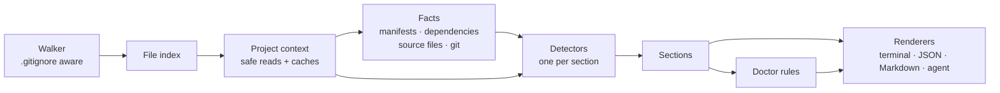

# Architecture

**English** | [Português (Brasil)](pt-BR/architecture.md)

RepoLens is a pipeline. It indexes the files once, runs independent detectors against
that index, runs doctor rules on the detected facts, then renders the result.



## The pieces

### Walker and file index (`src/core/walker.ts`, `src/core/file-index.ts`)

The walker lists the repository breadth-first with bounded concurrency:

- It applies the root `.gitignore`, nested `.gitignore` files (relative to their own
  directory, deeper files taking precedence) and `.git/info/exclude`.
- It never enters `node_modules`, `vendor`, `.git`, or framework and tool caches
  (`.next`, `.nuxt`, `.turbo`, `coverage`, …), even when they are not gitignored.
- Gitignored **directories** are skipped. Gitignored **files** in visited directories are
  still recorded, separately (`ignoredFiles`). That is how RepoLens finds your `.env` even
  though it is (correctly) gitignored.
- It stops at a file limit (default 100,000) and a depth limit (default 20). Truncation is
  deterministic.
- The configuration's `ignore` patterns work like one more `.gitignore` that no negation
  elsewhere can override, except that `isIgnored` keeps answering for Git alone.

The result is an in-memory `FileIndex` with fast lookups: `has`, `byName`, `byExtension`,
`glob`, `isIgnored`. Detectors query the index instead of touching the disk to discover
files.

### Configuration (`src/config/`)

Before the walk, `createContext` loads the configuration files (`load.ts`), validates them
(`validate.ts`: unknown keys, wrong types and unsafe values are dropped with a `config`
warning) and merges them (`resolve.ts`, which also refuses to let a project's own file turn
off security checks). The result is `ctx.options.config`: the walker uses `ignore` and
`maxFiles`, `runDoctor` applies `doctor.rules`, and the environment checks skip
`environment.provided` variables. The CLI adds the user config and `--config` files, and
applies `doctor.failOn` and the output preferences itself.

### Project context (`src/core/context.ts`)

Every detector receives a `ProjectContext`:

```ts
interface ProjectContext {
  root: string                    // never printed
  files: FileIndex
  use<T>(analyzer: Analyzer<T>): Promise<T>  // memoized
  readText(path, options?): Promise<string | null>
  readJson / readJsonc / readYaml(path): Promise<T | null>
  warn(warning): void
  debug(message): void
}
```

- All reads go through `readTextWithin`, which enforces the [security model](security.md):
  root containment after resolving symlinks, size limits, binary detection, and no FIFOs.
- Reads and parsed results are cached, so two detectors reading `package.json` parse it
  once. A malformed file produces exactly one warning, no matter how many detectors read it.
- Reads are limited to 48 concurrent file handles.

### Analyzers, facts and detectors

An **analyzer** is `{ id, run(ctx) }`. `ctx.use(analyzer)` runs it at most once per scan and
returns the memoized promise. That gives detectors a dependency mechanism without a
scheduler or topological sort: a detector simply awaits what it needs.

**Facts** (`src/facts/`) are analyzers whose results are shared but not printed:

| Fact | Provides |
| --- | --- |
| `manifests` | Parsed root/workspace/nested `package.json` files, workspace declarations, pnpm catalogs (resolved), `go.mod`/`go.work` modules. |
| `dependencies` | An index of every declared npm and Go dependency, by name and by package. |
| `sourceFiles` | Source files worth reading for content analysis (no `.d.ts`, minified bundles or build output), with their owning package. |
| `gitLayout`, `gitIndex`, `gitTrackedFiles` | Where Git metadata lives, the parsed index, and which files are tracked, read without running `git`. |
| `dockerfiles`, `composeFiles` | Every Dockerfile and Compose file, discovered and parsed once (with bounded `ARG` expansion), shared by services, runtimes, environment and doctor. |

**Detectors** (`src/detectors/`) are analyzers that produce one section of the result.
The registry in `src/detectors/index.ts` is a mapped type over the `Sections` interface,
so the compiler guarantees that every section has exactly one detector:

```ts
export const detectors: { [K in SectionId]: Detector<K> } = {
  project: projectDetector,
  frameworks: frameworksDetector,
  // …
}
```

Detectors run concurrently. If one throws, its section falls back to an empty value and a
warning is recorded, so a bug in route extraction can't take down the whole scan.

Most detectors are split into a thin *gather* step, which reads files through `ctx`, and
*pure* inference functions that take plain data. The pure functions carry most of the
logic and are unit-tested directly.

Knowledge about specific technologies lives in data tables rather than code paths:
`FRAMEWORKS` in `frameworks.ts`, the `ToolSpec` tables for test/lint/build tools, and
`src/detectors/knowledge/` for databases, drivers, ORMs and Docker images. Supporting a
new technology is usually a table entry plus a test; see
[creating-a-detector.md](creating-a-detector.md).

### Confidence

Findings that can be uncertain (frameworks, tools, databases, routes) carry a
`confidence` of `high`, `medium` or `low` and a list of human-readable `evidence`.
Detectors always report what they found. The CLI hides `low` findings unless `--verbose`
is set (`filterByConfidence` in `src/core/confidence.ts`), and the programmatic API
returns everything.

### Doctor (`src/doctor/`)

A doctor rule is:

```ts
interface DoctorRule {
  code: string          // stable, e.g. "ENV_UNDOCUMENTED"
  category: DiagnosticCategory
  title: string
  applies?(sections, ctx): boolean   // false → "skipped", not "passed"
  check(sections, ctx): Diagnostic[] | Promise<Diagnostic[]>
}
```

Rules only look at detector output and cached reads, so they are cheap and easy to test
with hand-built sections. Codes are part of the public contract and are never renamed.
See [diagnostics.md](diagnostics.md).

### Output (`src/output/`, `src/agent/`)

Renderers are pure functions from `ScanResult` to a string: terminal (`renderScan`,
`renderDoctor`), Markdown (`renderMarkdown`), JSON and agent files. They do no I/O. The CLI
(`src/cli/main.ts`) decides where the output goes.

- `src/output/commands.ts` is the one place that decides which commands to suggest
  (install, start services, dev, test, …). Every repository-derived argument goes
  through `shellQuote`, so a hostile file name can't turn a copy-pasted suggestion into
  a different command.
- `src/output/shared/` holds the data-to-text helpers all formats use (labels, sort orders,
  summaries), so the terminal, Markdown and agent output agree.
- `src/utils/text.ts` `cleanUntrusted` strips control, bidi, zero-width and Unicode tag
  characters from repository text before any format escapes it.

## Design decisions

- **No plugin loader in v1.** The detector interface is small and stable enough for
  external detectors later (`@repolens/detector-*`), but loading third-party code into a
  tool whose main promise is "safe on untrusted repos" deserves its own design.
  Contributions to the built-in detectors are the path for now.
- **No AST parser.** Route and environment-variable extraction use conservative patterns
  plus explicit confidence levels. A full TypeScript/Go parser would multiply install
  size and scan time for a modest gain in recall. False positives are treated as worse than
  misses.
- **Three runtime dependencies**: `yaml` (YAML 1.2 parser), `ignore` (gitignore
  semantics), `semver` (range checks). All three have no dependencies of their own. CLI
  parsing (`node:util` `parseArgs`), colors and globbing are built in.
- **Deterministic output.** No timestamps, sorted collections (with a locale-independent
  comparison, enforced by a test), no absolute paths. A report for the same commit is
  byte-identical, so `.repolens/` files diff cleanly. RepoLens never indexes its own
  `.repolens/` output.

## Ready for MCP

The internal API maps directly onto the tools an MCP server would expose. A future
`repolens mcp` command would be a thin adapter:

| Potential MCP tool | Implementation |
| --- | --- |
| `get_project_overview` | `scan()` → `project`, `languages`, `runtimes`, `frameworks`, `workspace` |
| `get_services` | `scan()` → `services`, `databases` |
| `get_environment_variables` | `scan()` → `environment` (names and flags only) |
| `get_routes` | `scan()` → `routes` |
| `get_scripts` | `scan()` → `scripts` |
| `get_diagnostics` | `scan()` → `doctor` |

For a single section, `createContext()` plus `ctx.use(detectors.routes)` runs just that
detector and the facts it needs.
