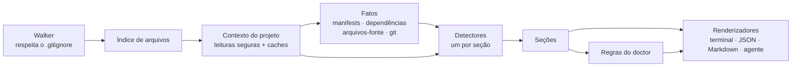

# Arquitetura

[English](../architecture.md) | **Português (Brasil)**

O RepoLens é um pipeline. Ele indexa os arquivos uma vez, roda detectores independentes sobre
esse índice, roda as regras do doctor sobre os fatos detectados e, por fim, renderiza o
resultado.



## As peças

### Walker e índice de arquivos (`src/core/walker.ts`, `src/core/file-index.ts`)

O walker (que percorre os arquivos) lista o repositório em largura (breadth-first), com
concorrência limitada:

- Ele aplica o `.gitignore` da raiz, os arquivos `.gitignore` aninhados (relativos ao próprio
  diretório, com os mais profundos tendo precedência) e o `.git/info/exclude`.
- Ele nunca entra em `node_modules`, `vendor`, `.git` nem em caches de frameworks e
  ferramentas (`.next`, `.nuxt`, `.turbo`, `coverage`, …), mesmo quando eles não estão no
  gitignore.
- **Diretórios** ignorados pelo Git são pulados. **Arquivos** ignorados pelo Git em
  diretórios visitados continuam sendo registrados, separadamente (`ignoredFiles`). É assim
  que o RepoLens encontra o seu `.env`, mesmo ele estando (corretamente) no gitignore.
- Ele para em um limite de arquivos (padrão: 100.000) e em um limite de profundidade (padrão:
  20). O truncamento é determinístico.
- Os padrões `ignore` da configuração funcionam como mais um `.gitignore`, que nenhuma
  negação em outro lugar consegue sobrescrever, com uma diferença: `isIgnored` continua
  respondendo apenas pelo Git.

O resultado é um `FileIndex` em memória com consultas rápidas: `has`, `byName`,
`byExtension`, `glob`, `isIgnored`. Os detectores consultam o índice em vez de acessar o disco
para descobrir arquivos.

### Configuração (`src/config/`)

Antes de percorrer os arquivos, `createContext` carrega os arquivos de configuração
(`load.ts`), valida esses arquivos (`validate.ts`: chaves desconhecidas, tipos errados e
valores inseguros são descartados com um aviso `config`) e mescla todos eles (`resolve.ts`,
que também impede que o arquivo do próprio projeto desligue verificações de segurança). O
resultado é `ctx.options.config`: o walker usa `ignore` e `maxFiles`, `runDoctor` aplica
`doctor.rules` e as verificações de ambiente ignoram as variáveis de `environment.provided`.
A CLI adiciona a configuração do usuário e os arquivos de `--config`, e ela mesma aplica
`doctor.failOn` e as preferências de saída.

### Contexto do projeto (`src/core/context.ts`)

Todo detector recebe um `ProjectContext`:

```ts
interface ProjectContext {
  root: string                    // nunca é impresso
  files: FileIndex
  use<T>(analyzer: Analyzer<T>): Promise<T>  // memoizado
  readText(path, options?): Promise<string | null>
  readJson / readJsonc / readYaml(path): Promise<T | null>
  warn(warning): void
  debug(message): void
}
```

- Todas as leituras passam por `readTextWithin`, que aplica o
  [modelo de segurança](security.md): confinamento à raiz depois de resolver links
  simbólicos, limites de tamanho, detecção de binários e nada de FIFOs.
- As leituras e os resultados parseados ficam em cache, então dois detectores lendo o
  `package.json` fazem o parse dele uma vez só. Um arquivo malformado gera exatamente um
  aviso, não importa quantos detectores o leiam.
- As leituras são limitadas a 48 file handles simultâneos.

### Analisadores, fatos e detectores

Um **analisador** é `{ id, run(ctx) }`. `ctx.use(analyzer)` executa o analisador no máximo
uma vez por análise e devolve a promise memoizada. Isso dá aos detectores um mecanismo de
dependência sem agendador nem ordenação topológica: um detector simplesmente aguarda
(`await`) o que precisa.

**Fatos** (`src/facts/`) são analisadores cujos resultados são compartilhados, mas não
impressos:

| Fato | Fornece |
| --- | --- |
| `manifests` | Arquivos `package.json` parseados (da raiz, dos workspaces e aninhados), declarações de workspace, catálogos do pnpm (resolvidos), módulos `go.mod`/`go.work`. |
| `dependencies` | Um índice de toda dependência npm e Go declarada, por nome e por pacote. |
| `sourceFiles` | Arquivos-fonte que valem a leitura para análise de conteúdo (sem `.d.ts`, bundles minificados ou saída de build), com o pacote a que cada um pertence. |
| `gitLayout`, `gitIndex`, `gitTrackedFiles` | Onde ficam os metadados do Git, o índice parseado e quais arquivos são rastreados, tudo lido sem executar `git`. |
| `dockerfiles`, `composeFiles` | Todo Dockerfile e arquivo Compose, descobertos e parseados uma vez (com expansão limitada de `ARG`), compartilhados por services, runtimes, environment e doctor. |

**Detectores** (`src/detectors/`) são analisadores que produzem uma seção do resultado.
O registro em `src/detectors/index.ts` é um mapped type sobre a interface `Sections`,
então o compilador garante que toda seção tenha exatamente um detector:

```ts
export const detectors: { [K in SectionId]: Detector<K> } = {
  project: projectDetector,
  frameworks: frameworksDetector,
  // …
}
```

Os detectores rodam de forma concorrente. Se um deles lançar uma exceção, a seção dele volta
para um valor vazio e um aviso é registrado, então um bug na extração de rotas não derruba a
análise inteira.

A maioria dos detectores é dividida em uma etapa enxuta de *coleta* (*gather*), que lê
arquivos através do `ctx`, e em funções de inferência *puras*, que recebem dados simples. As
funções puras concentram a maior parte da lógica e têm testes unitários diretos.

O conhecimento sobre tecnologias específicas fica em tabelas de dados, e não em caminhos de
código: `FRAMEWORKS` em `frameworks.ts`, as tabelas `ToolSpec` de ferramentas de
teste/lint/build e `src/detectors/knowledge/` para bancos de dados, drivers, ORMs e imagens
Docker. Dar suporte a uma nova tecnologia normalmente é uma entrada de tabela mais um teste;
veja [creating-a-detector.md](creating-a-detector.md).

### Confiança

Achados que podem ser incertos (frameworks, ferramentas, bancos de dados, rotas) trazem uma
`confidence` de `high`, `medium` ou `low` e uma lista de `evidence` legível por humanos.
Os detectores sempre reportam o que encontraram. A CLI esconde os achados `low`, a menos que
`--verbose` esteja ativo (`filterByConfidence` em `src/core/confidence.ts`), e a API
programática devolve tudo.

### Doctor (`src/doctor/`)

Uma regra do doctor é:

```ts
interface DoctorRule {
  code: string          // estável, ex.: "ENV_UNDOCUMENTED"
  category: DiagnosticCategory
  title: string
  applies?(sections, ctx): boolean   // false → "skipped", não "passed"
  check(sections, ctx): Diagnostic[] | Promise<Diagnostic[]>
}
```

As regras só olham a saída dos detectores e leituras em cache, então são baratas e fáceis de
testar com seções montadas à mão. Os códigos fazem parte do contrato público e nunca são
renomeados. Veja [diagnostics.md](diagnostics.md).

### Saída (`src/output/`, `src/agent/`)

Renderizadores são funções puras que transformam um `ScanResult` em uma string: terminal
(`renderScan`, `renderDoctor`), Markdown (`renderMarkdown`), JSON e arquivos para agentes.
Eles não fazem I/O. A CLI (`src/cli/main.ts`) decide para onde a saída vai.

- `src/output/commands.ts` é o único lugar que decide quais comandos sugerir (install, subir
  serviços, dev, test, …). Todo argumento derivado do repositório passa por `shellQuote`,
  então um nome de arquivo malicioso não consegue transformar uma sugestão copiada e colada
  em outro comando.
- `src/output/shared/` guarda os helpers de dados para texto que todos os formatos usam
  (rótulos, ordenações, resumos), para que as saídas de terminal, Markdown e agente
  concordem entre si.
- Em `src/utils/text.ts`, `cleanUntrusted` remove caracteres de controle, bidi, de largura
  zero e de tag Unicode do texto vindo do repositório, antes que qualquer formato faça o
  escape dele.

## Decisões de design

- **Sem carregador de plugins na v1.** A interface de detector é pequena e estável o bastante
  para detectores externos no futuro (`@repolens/detector-*`), mas carregar código de
  terceiros em uma ferramenta cuja principal promessa é ser "segura em repositórios não
  confiáveis" merece um design próprio. Por enquanto, o caminho é contribuir com os
  detectores embutidos.
- **Sem parser de AST.** A extração de rotas e de variáveis de ambiente usa padrões
  conservadores e níveis de confiança explícitos. Um parser completo de TypeScript/Go
  multiplicaria o tamanho da instalação e o tempo de análise por um ganho modesto de recall.
  Falsos positivos são tratados como piores do que deixar algo passar.
- **Três dependências de runtime**: `yaml` (parser de YAML 1.2), `ignore` (semântica do
  gitignore), `semver` (checagem de ranges). Nenhuma das três tem dependências próprias. O
  parsing de argumentos da CLI (`parseArgs` do `node:util`), as cores e o globbing são
  embutidos.
- **Saída determinística.** Sem timestamps, com coleções ordenadas (usando uma comparação
  independente de locale, garantida por um teste) e sem caminhos absolutos. Um relatório do
  mesmo commit é idêntico byte a byte, então os arquivos em `.repolens/` geram diffs limpos.
  O RepoLens nunca indexa a própria saída em `.repolens/`.

## Pronto para MCP

A API interna se mapeia diretamente nas ferramentas que um servidor MCP exporia. Um futuro
comando `repolens mcp` seria um adaptador fino:

| Possível ferramenta MCP | Implementação |
| --- | --- |
| `get_project_overview` | `scan()` → `project`, `languages`, `runtimes`, `frameworks`, `workspace` |
| `get_services` | `scan()` → `services`, `databases` |
| `get_environment_variables` | `scan()` → `environment` (apenas nomes e flags) |
| `get_routes` | `scan()` → `routes` |
| `get_scripts` | `scan()` → `scripts` |
| `get_diagnostics` | `scan()` → `doctor` |

Para uma única seção, `createContext()` mais `ctx.use(detectors.routes)` roda só esse
detector e os fatos de que ele precisa.
